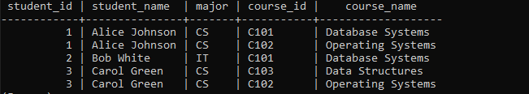
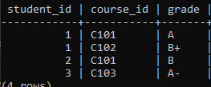

# SQL DOCUMENT
##  Normalisation
Normalisation is the process of minimizing redundancy from a relations to avoid redundancy and avoid anomalies.All types of database normalization are cumulative in that each one builds on top of those beneath it
  let's look at them.
### First Normal Form(1NF)  
  For a table to be in the first normal form, it must meet the following criteria:

-a single cell must not hold more than one value (atomicity)
-there must be a primary key for identification 
-no duplicated rows or columns
each column must have only one value for each row in the table
Example  

### Second Normal Form (2NF )
The 1NF only eliminates repeating groups, not redundancy. That's why there is 2NF.

A table is said to be in 2NF if it meets the following criteria:  

-It's already in 1NF  
-It has no partial dependency. That is, all non-key attributes are fully dependent on a primary key.  
-In the current table, Student_Name and Major depend only on Student_ID, not the combination of Student_ID and Course_ID. To fix this, we decompose the table.  
Example  
   
students table 
  
courses table  

### Third Normal Form (3NF)  
3NF requires:  

The table must be in 2NF.
There must be no transitive dependency (i.e., non-key attributes should not depend on other non-key attributes).
In the Courses table, all non-key attributes (Course_Name, Credits, Instructor) depend only on the primary key (Course_ID), so there are no transitive dependencies. Likewise, in the Students and Enrollments tables, there are no transitive dependencies. Therefore, the tables are already in 3NF.
### Boyce-codd Normal Form (BCNF)  
BCNF requires that:

-The table is already in 3NF.  
-Every determinant is a candidate key (i.e., there are no non-trivial functional dependencies where the determinant is not a superkey).  
### Fourth Normal   Form(4NF)  
4NF requires that:

-The table is already in BCNF.  
-There are no multi-valued dependencies.
Our current design does not have multi-valued dependencies (no attribute has multiple values for a single key in any of the tables), so we are already in 4NF.

## SQL JOINS
### 1.Inner Join.
The inner join is used to combine rows from two or more tables based on a similar column between them.It then returns rows when there is atleast one match in both tables.
Syntax:  
SELECT<table1.column1>,<table1.column2>  
FROM table1 INNER JOIN table2    

### Example:
Residents table  
  
cities table  
  
inner join    

## 2.Left Join  
The left keyword returns all records from the left table (residents table) and matching records from the right table (cities table)
syntax:  
SELECT column_name(s)  
FROM table1  
LEFT JOIN table2  
ON table1.column_name = table2.column_name;
### Example

## 3.Right join
The right join key word returns all records from the cities table and the matching records from the residents table.
syntax:  
SELECT column_name(s)  
FROM cities  
RIGHT JOIN residents
ON table1.column_name = table2.column_name;
 ### Example
 
## 4.Full Join  
It returns all records when there is a match in left table or right table records.
syntax:  
SELECT column_name(s)  
FROM table1  
FULL JOIN table2  
ON table1.column_name = table2.column_name  
WHERE condition;  

## ACID PROPERTIES
ACID is abbreviation for ATOMICITY,CONSISTENCY,ISOLATION and DURABILITY  
  Example:  
Imagine you are transferring money from your savings account to your checking account. Let's say you want to transfer $500.

### ATOMICITY

It is a property that ensures that a process takes place at once or doesnt happen at all.There is no in between .  
Using our scenario, If any part of the transfer fails, the whole transaction is taken back.It is either the $500 is fully transferred, or nothing changes at all.
Example: If the bank deducts $100 from your savings account but fails to add it to your checking account due to a system crash, the system will stop the process , and no money will be deducted.
### CONSISTENCY
According to this property, only valid data is written to the database. Consistency enforces integrity constraints to maintain the accuracy and correctness of data.
After the transfer, both accounts should reflect a total balance of $500 if that was the balance before the transaction. If there were inconsistencies, such as $100 disappearing, the database would be in an invalid state, violating consistency.

### ISOLATION
Running transactions independently is the core of isolation. Changes in one transaction will not impact others until committed. Isolation maintains data integrity across concurrent transactions. 
If two people are transferring money at the same time, one transaction won't affect the other. Your $500 transfer will complete independently, even if someone else is also transferring money between their accounts.
### DURABILITY
Durability guarantees that all committed transactions are permanently recorded in the database. They persist even after system failure. Durability provides recoverability.
Example: Once the $100 is successfully transferred and the transaction is completed, the changes are saved permanently. Even if the bank’s system crashes, the record of your transfer will remain intact when it recovers.